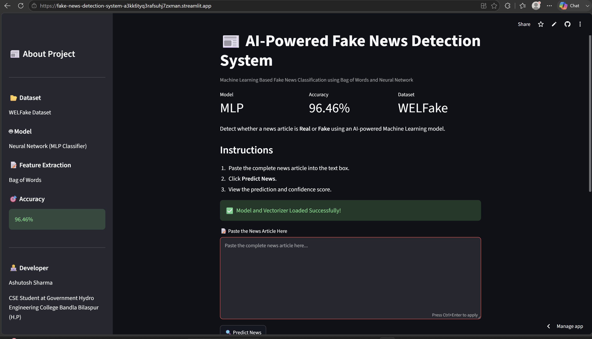

# 📰 Fake News Detection System

An AI-powered Fake News Detection web application built using **Machine Learning**, **Natural Language Processing (NLP)**, and **Streamlit**.

The application allows users to paste a news article and predicts whether it is **Real** or **Fake** using a trained Neural Network model.

---

## 🌐 Live Demo

🚀 **Click here to use the application**

👉 **[Launch Fake News Detection App](https://fake-news-detection-system-a3kk6tyq3rafsuhj7zxman.streamlit.app)**

---

---

## 🚀 Features

- ✅ Detects whether a news article is Real or Fake
- ✅ Interactive Streamlit web application
- ✅ Text preprocessing using NLP
- ✅ Bag of Words feature extraction
- ✅ Neural Network (MLPClassifier) model
- ✅ Displays prediction confidence
- ✅ User-friendly interface

---

## 🛠 Technologies Used

- Python
- Streamlit
- Scikit-learn
- Pandas
- NumPy
- NLTK
- Joblib

---

## 📂 Project Structure

```text
Fake-News-Detection/
│
├── app.py
├── README.md
├── requirements.txt
├── .gitignore
│
├── models/
│   ├── best_fake_news_model.pkl
│   ├── bow_vectorizer.pkl
│   └── model_information.pkl
│
├── notebooks/
│
├── screenshots/
│
├── assets/
│
└── WELFake_Dataset.csv
```
## 📷 Application Screenshots

### Home Page



---

### Real News Prediction


---

### Fake News Prediction

